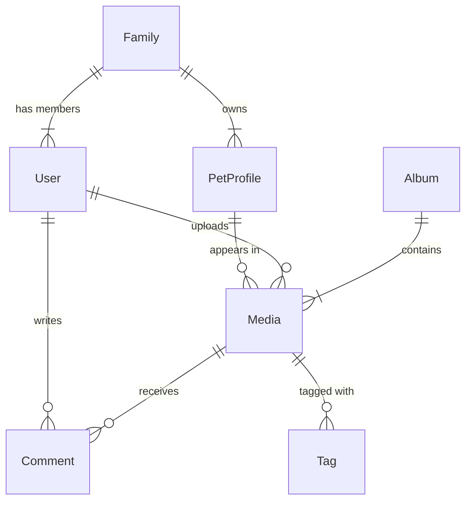

# データ設計書 (Data Design Document)

## 1. 概念データモデル (Conceptual Data Model)

このアプリケーションは、**家族 (Family)** と **ペット (PetProfile)** を中心に、**メディア (Media)** を共有する構造を持ちます。

## 2. データベース設計 (Database Schema)

### 2.1 Users Table (ユーザー管理)

認証情報とユーザープロファイル。

| Column | Type | Constraints | Description |
| :--- | :--- | :--- | :--- |
| `id` | UUID | PK | ユーザーID |
| `email` | VARCHAR | UNIQUE, NOT NULL | メールアドレス (Google Account) |
| `name` | VARCHAR | NOT NULL | 表示名 |
| `avatar_url` | VARCHAR | | Googleアバター画像URL |
| `role` | VARCHAR | DEFAULT 'member' | 権限 ('admin', 'member') |
| `created_at` | TIMESTAMP | DEFAULT NOW() | |

### 2.2 Families Table (家族・共有グループ)

共有の単位となるグループ。

| Column | Type | Constraints | Description |
| :--- | :--- | :--- | :--- |
| `id` | UUID | PK | 家族ID |
| `name` | VARCHAR | NOT NULL | 家族グループ名（例: "佐藤家"） |
| `invite_code` | VARCHAR | UNIQUE | 招待用コード |

### 2.3 FamilyMembers Table (所属関係)

ユーザーと家族の多対多関係（基本は1対1だが拡張性確保）。

| Column | Type | Constraints | Description |
| :--- | :--- | :--- | :--- |
| `user_id` | UUID | PF, FK(Users) | |
| `family_id` | UUID | PK, FK(Families) | |
| `joined_at` | TIMESTAMP | DEFAULT NOW() | |

### 2.4 PetProfiles Table (ペット情報)

家族に紐づくペットのプロフィール。

| Column | Type | Constraints | Description |
| :--- | :--- | :--- | :--- |
| `id` | UUID | PK | ペットID |
| `family_id` | UUID | FK(Families) | 所有する家族ID |
| `name` | VARCHAR | NOT NULL | ペットの名前 |
| `species` | VARCHAR | NOT NULL | 種類 ('Dog', 'Cat', etc.) |
| `breed` | VARCHAR | | 犬種・猫種など |
| `birth_date` | DATE | | 誕生日 |
| `adoption_date`| DATE | | うちの子記念日 |
| `gender` | VARCHAR | | 性別 |
| `avatar_url` | VARCHAR | | プロフィール画像 |

### 2.5 Media Table (写真・動画)

メインコンテンツ。

| Column | Type | Constraints | Description |
| :--- | :--- | :--- | :--- |
| `id` | UUID | PK | メディアID |
| `family_id` | UUID | FK(Families) | 所有家族（アクセス権） |
| `uploader_id`| UUID | FK(Users) | 投稿者 |
| `pet_id` | UUID | FK(PetProfiles) | 関連ペット（NULL許容: 家族写真など） |
| `type` | VARCHAR | NOT NULL | 'image' or 'video' |
| `status` | VARCHAR | DEFAULT 'ready' | 'processing', 'ready', 'error' |
| `original_url`| VARCHAR | NOT NULL | S3等のオブジェクトキー |
| `thumbnail_url`| VARCHAR | | サムネイルURL |
| `filename` | VARCHAR | NOT NULL | オリジナルファイル名 |
| `taken_at` | TIMESTAMP | | 撮影日時 (EXIF) |
| `created_at` | TIMESTAMP | DEFAULT NOW() | アップロード日時 |
| `width` | INT | | |
| `height` | INT | | |
| `file_size` | BIGINT | | バイト数 |
| `is_favorite`| BOOLEAN | DEFAULT FALSE | お気に入りフラグ |

### 2.6 Tags Table (タグ)

| Column | Type | Constraints | Description |
| :--- | :--- | :--- | :--- |
| `id` | UUID | PK | |
| `name` | VARCHAR | UNIQUE, NOT NULL | タグ名 ("散歩", "柴犬") |

### 2.7 MediaTags Table (タグ付け関係)

| Column | Type | Constraints | Description |
| :--- | :--- | :--- | :--- |
| `media_id` | UUID | PK, FK(Media) | |
| `tag_id` | UUID | PK, FK(Tags) | |

### 2.8 Albums Table (アルバム)

ユーザーが作成するコレクション。

| Column | Type | Constraints | Description |
| :--- | :--- | :--- | :--- |
| `id` | UUID | PK | |
| `family_id` | UUID | FK(Families) | |
| `title` | VARCHAR | NOT NULL | アルバム名 |
| `description`| TEXT | | 説明 |

### 2.9 AlbumItems Table (アルバム詳細)

| Column | Type | Constraints | Description |
| :--- | :--- | :--- | :--- |
| `album_id` | UUID | PK, FK(Albums) | |
| `media_id` | UUID | PK, FK(Media) | |
| `order` | INT | | 表示順序 |

## 3. インデックス設計 (Indexing Strategy)

パフォーマンス最適化のためのインデックス計画。

- **Media**:
  - `(family_id, taken_at DESC)`: タイムライン表示用（複合インデックス）。
  - `(family_id, is_favorite)`: お気に入り絞り込み用。
  - `(pet_id)`: ペット別フィルタリング用。
- **Tags**:
  - `(name)`: タグ検索・補完用。

## 4. スケーラビリティ & 移行計画

現状はSQLiteを用いているが、この設計はPostgreSQL等のRDBMSへの移行を前提としている。

- **ID戦略**: 将来的な分散環境を見据え、`AUTO_INCREMENT` ではなく `UUID` (v4 または v7) を採用。
- **物理ファイル**: DBには保存せず、ファイルパス（またはObject StorageのKey）のみを保持。
