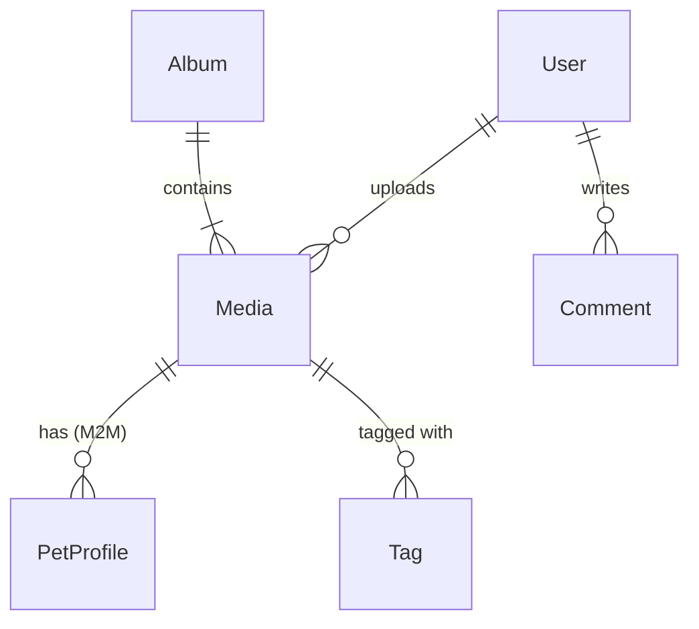

# データ設計書 (Data Design Document)

## 1. 概念データモデル (Conceptual Data Model)

このアプリケーションは、**ユーザー (User)** が投稿した **メディア (Media)** を中心とした構造を持ちます。
家族機能は廃止されました。ペット (PetProfile) は独立したマスタとして存在し、メディアと多対多で紐付きます。

## 2. データベース設計 (Database Schema)

**Platform**: Supabase (PostgreSQL 15+)
**ID Strategy**: UUID v7 (時系列ソート可能なUUID) を採用。

### 2.1 Users Table (ユーザー管理)

認証情報とユーザープロファイル。

| Column | Type | Constraints | Description |
| :--- | :--- | :--- | :--- |
| `id` | UUID | PK | ユーザーID (UUID v7) |
| `email` | VARCHAR | UNIQUE, NOT NULL | メールアドレス (Google Account) |
| `name` | VARCHAR | NOT NULL | 表示名 |
| `google_id` | VARCHAR | UNIQUE | Google ID |
| `avatar_url` | VARCHAR | | Googleアバター画像URL |
| `display_name` | VARCHAR | | 表示用ニックネーム |
| `bio` | VARCHAR | | 自己紹介 |
| `role` | VARCHAR | DEFAULT 'guest' | 権限 ('owner', 'family', 'guest') |
| `created_at` | TIMESTAMP | DEFAULT NOW() | |

### 2.2 PetProfiles Table (ペット情報)

ペットのマスタ情報。現在オーナー紐付けカラムは未定義（将来拡張予定）。

| Column | Type | Constraints | Description |
| :--- | :--- | :--- | :--- |
| `id` | UUID | PK | ペットID |
| `name` | VARCHAR | NOT NULL | ペットの名前 |
| `type` | VARCHAR | | 種類 ('dog', 'cat', etc.) |
| `breed` | VARCHAR | | 犬種・猫種など |
| `gender` | VARCHAR | | 性別 |
| `birth_date` | VARCHAR | | 誕生日 |
| `adoption_date`| VARCHAR | | うちの子記念日 |
| `avatar_url` | VARCHAR | | プロフィール画像 |
| `description` | TEXT | | メモ・特徴など |

### 2.3 Media Table (写真・動画)

メインコンテンツ。

| Column | Type | Constraints | Description |
| :--- | :--- | :--- | :--- |
| `id` | UUID | PK | メディアID |
| `uploader_id`| UUID | FK(Users) | 投稿者 |
| `filename` | VARCHAR | NOT NULL | 保存パス (galleries/YYYY/MM/xxx) |
| `original_filename` | VARCHAR | NOT NULL | アップロード時のファイル名 |
| `mime_type` | VARCHAR | NOT NULL | MIME Type |
| `file_size_bytes` | BIGINT | NOT NULL | ファイルサイズ |
| `width` | INT | | |
| `height` | INT | | |
| `duration_sec` | INT | | 動画の長さ |
| `description` | TEXT | | 説明 |
| `taken_at` | VARCHAR | | 撮影日時 (ISO String) |
| `status` | VARCHAR | DEFAULT 'processing' | 'processing', 'ready', 'error' |
| `thumbnail_path`| VARCHAR | | サムネイルパス |
| `created_at` | TIMESTAMP | DEFAULT NOW() | アップロード日時 |

### 2.4 Tags Table (タグ)

| Column | Type | Constraints | Description |
| :--- | :--- | :--- | :--- |
| `id` | UUID | PK | |
| `name` | VARCHAR | UNIQUE, NOT NULL | タグ名 |

### 2.5 Albums Table (アルバム)

| Column | Type | Constraints | Description |
| :--- | :--- | :--- | :--- |
| `id` | UUID | PK | |
| `name` | VARCHAR | NOT NULL | アルバム名 |
| `description`| TEXT | | 説明 |

---

## 3. 関連テーブル (Association Tables)

多対多の関係を管理する中間テーブル。

### 3.1 media_pets

メディアとペットの紐付け。

| Column | Type | Constraints |
| :--- | :--- | :--- |
| `media_id` | UUID | PK, FK(Media) |
| `pet_id` | UUID | PK, FK(PetProfiles) |

### 3.2 media_tags

メディアとタグの紐付け。

| Column | Type | Constraints |
| :--- | :--- | :--- |
| `media_id` | UUID | PK, FK(Media) |
| `tag_id` | UUID | PK, FK(Tags) |

### 3.3 media_favorites

お気に入り登録。

| Column | Type | Constraints |
| :--- | :--- | :--- |
| `media_id` | UUID | PK, FK(Media) |
| `user_id` | UUID | PK, FK(Users) |
| `created_at` | TIMESTAMP | DEFAULT NOW() |

### 3.4 album_media

アルバム内のアイテム。

| Column | Type | Constraints |
| :--- | :--- | :--- |
| `album_id` | UUID | PK, FK(Albums) |
| `media_id` | UUID | PK, FK(Media) |
| `created_at` | TIMESTAMP | DEFAULT NOW() |

---

## 4. インデックス設計 (Indexing Strategy)

- **Users**: `(email)`, `(google_id)`
- **Media**: `(status)` - 処理待ちタスクの取得用
