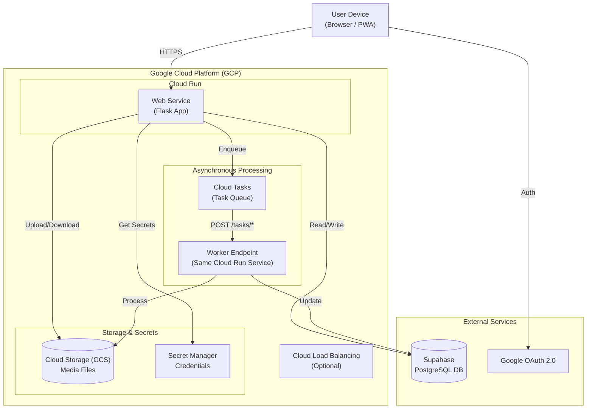

# システム構成設計書 (System Architecture Document)

## 1. アーキテクチャ概要 (Architecture Overview)

本システムは、**Google Cloud Platform (GCP) Serverless Architecture** を採用します。
スケーラビリティ、運用コストの最適化、および開発効率を重視し、Modular Monolithなアプリケーションをコンテナ化してデプロイします。

### 1.1 アーキテクチャ選定理由

現在の要件（画像・動画の共有、AI処理、低ランニングコスト）と開発規模に基づき、以下の構成としました。

| 項目 | Serverless (採用) | GCE All-in-One | 採用理由 |
| :--- | :--- | :--- | :--- |
| **スケーラビリティ** | ◎ 自動スケール | △ 手動 | Cloud Runにより、トラフィックに応じた0からの自動スケールが可能。 |
| **運用コスト** | ◎ 従量課金 | △ 常時課金 | アイドル時はインスタンス数0になり、課金が発生しない（データベース除く）。 |
| **デプロイ** | ◎ コンテナベース | △ 手動/Ansible | コンテナをArtifact RegistryにPushするだけでデプロイ完了。ロールバックも容易。 |
| **データ永続性** | ◎ マネージド | △ 自己管理 | Supabase (PostgreSQL) と GCS を利用し、ステートレスなアプリサーバーを実現。 |

### 1.2 システム構成図 (Cloud Run + Supabase)



## 2. 技術スタック (Tech Stack)

### 2.1 バックエンド (Backend)

- **Framework: Flask (Python)**
  - **理由**: 軽量かつ柔軟で、画像処理ライブラリ（Pillow, FFmpeg等）との親和性が高い。
- **Task Queue: Cloud Tasks**
  - **理由**: フルマネージドな非同期タスク実行基盤。Celeryのようなワーカー管理が不要で、HTTPリクエストとしてタスクを実行できるため、Cloud Runとの相性が抜群。
- **Database: Supabase (PostgreSQL)**
  - **理由**: フルマネージドなPostgreSQLサービス。Free Tierが充実しており、将来的なリアルタイム機能やAuth連携の可能性も視野に採用。
  - **ORM**: SQLAlchemy

### 2.2 フロントエンド (Frontend)

- **Template Engine: Jinja2 (SSR)**
  - **理由**: SEOと初期表示速度を重視。複雑なSPAフレームワークを避け、開発速度を維持。
- **Styling: CSS (Vanilla/Custom)**
  - **理由**: 軽量かつ柔軟なデザイン修正が可能。

### 2.3 インフラ (Infrastructure)

- **Compute: Cloud Run**
  - **理由**: コンテナをサーバーレスで実行。HTTPSエンドポイントの自動提供、容易なデプロイ、ゼロスケール機能。
- **Storage: Google Cloud Storage (GCS)**
  - **理由**: 画像・動画の永続化。ローカルディスクを持たないCloud Runにおいて必須。
- **Secrets: Secret Manager**
  - **理由**: DB接続文字列やOAuthクライアントシークレットを安全に管理し、Cloud Runへ環境変数として注入。
- **IaC: Terraform**
  - **理由**: 環境（Dev/Staging/Prod）の複製と構成管理をコード化するため。

## 3. 処理方式設計 (Processing Model)

### 3.1 ハイブリッド開発環境

開発効率を最大化するため、環境に応じて処理方式を切り替えます。

| | Local Dev | Cloud (Staging/Prod) |
| :--- | :--- | :--- |
| **Storage** | Local File System | GCS |
| **Async Tasks** | Synchronous Execution | Cloud Tasks |
| **Database** | Local Postgres | Supabase |

### 3.2 画像・動画処理フロー (Cloud)

1. **Upload**: ユーザーがファイルをアップロード。
2. **Accept**: WebサーバーはGCSにファイルを保存し、DBレコードを作成。
3. **Enqueue**: Cloud Tasksに画像処理タスクを登録（HTTP Target: `/tasks/process-media`）。即座にレスポンスを返す。
4. **Async Process**:
    - Cloud TasksがWebサーバーの処理エンドポイントをコール。
    - GCSからファイルをメモリまたは一時ディレクトリにダウンロード。
    - 画像処理（リサイズ、サムネ生成、Exif抽出）または動画処理（サムネ生成）。
    - 処理済みファイルをGCSにアップロード（上書きまたは別名保存）。
    - DBのステータスを更新。

## 4. ディレクトリ構成

```
/thesalo-gallery
  /app
    /blueprints     # Routing Logic (Auth, Media, Core, Tasks)
    /models         # SQLAlchemy Models
    /services       # Business Logic
    /static         # Static Assets
    /templates      # HTML Templates
    /utils          # Utilities
    config.py       # Configuration
  /terraform        # Infra Definitions
  /docs             # Documentation
  Dockerfile
  docker-compose.yml # For Local Dev
```
