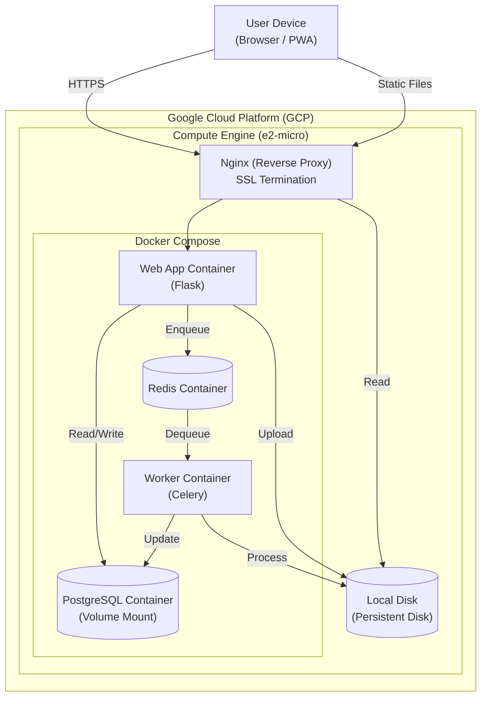

# システム構成設計書 (System Architecture Document)

## 1. アーキテクチャ概要 (Architecture Overview)

本システムは、**Modular Monolith (モジュラ・モノリス)** を採用します。
現在の開発体制（小規模）と要件（高機能な画像処理、整合性重視）に基づき、マイクロサービスではなくモノリス構成を選定しました。将来的なスケーリングが必要になった際、モジュール単位での切り出しが容易な設計とします。

### 1.1 アーキテクチャ選定理由

なぜマイクロサービスではなくモノリスなのか、比較検討を行いました。

| 項目 | Monolith (採用) | Microservices | 採用理由 |
| :--- | :--- | :--- | :--- |
| **開発効率** | ◎ 高い | △ 低い | チーム規模が小さいため、リポジトリ分割や通信設計のオーバーヘッドを避け、開発速度を優先する。 |
| **デプロイ** | ◎ 単純 | △ 複雑 | 一つのコンテナイメージとしてデプロイ完了するため、CI/CDパイプラインがシンプルで済む。 |
| **データ整合性** | ◎ 容易 (ACID) | △ 困難 (Eventual) | 家族・アカウント・メディアのデータ整合性が重要。分散トランザクションの複雑さを回避したい。 |
| **スケーラビリティ**| ◯ 可能 | ◎ 最適 | 重い処理（画像変換）のみ非同期ワーカーとして分離することで、必要な部分だけスケール可能。 |
| **インフラコスト** | ◎ 低い | △ 高い | 無料枠や安価なVPSでの運用を想定しており、多数のコンテナを常時起動するリソース消費を避けたい。 |

### 1.2 GCP無料枠（Free Tier）対応構成

ユーザー要望である「GCP無料枠」での運用を実現するため、マネージドサービス（Cloud SQL, Memorystore等）の使用を避け、**Google Compute Engine (GCE) の e2-micro インスタンス** 1台に全てのコンテナを集約する構成とします。

### ■ システム構成図 (GCE All-in-One)



## 2. 技術スタック (Tech Stack)

各技術の採用理由を定義します。

### 2.1 バックエンド (Backend)

- **Framework: Flask (Python)**
  - **理由**: 既存プロトタイプからの移行コストが低いこと、およびAI/画像処理ライブラリ（Pillow, OpenCV, PyTorch等）との親和性が非常に高いため。Djangoほど重厚ではなく、FastAPIほど非同期特化にする必要性が薄い（SSR中心のため）ことからバランスの良いFlaskを選定。
- **Task Queue: Celery**
  - **理由**: 画像リサイズ、動画トランスコード、AI顔認識といった「重い処理」をHTTPリクエストから切り離すために必須。Python界隈でのデファクトスタンダードであり、信頼性が高い。
- **Database: PostgreSQL**
  - **理由**: 複雑なリレーション（家族、ペット、タグ、アルバム）を堅牢に扱うため、JSON型や全文検索にも対応した強力なRDBMSが必要。SQLiteでは同時書き込みや将来の拡張性に不安があるため採用。

### 2.2 フロントエンド (Frontend)

- **Template Engine: Jinja2 (SSR)**
  - **理由**: SEOや初期表示速度（First Contentful Paint）に有利。React/VueのSPA構成は開発工数が増大するため、基本はサーバーサイドレンダリングとし、必要な箇所（アップローダー等）のみJavaScriptで動的に制御する「Hybridアプローチ」をとる。
- **PWA (Progressive Web App)**
  - **理由**: ネイティブアプリ開発コストを削減しつつ、ホーム画面追加やフルスクリーン表示などの「アプリライクな体験」を提供するため。

### 2.3 インフラ (Infrastructure - GCP Free Tier)

- **Compute: Google Compute Engine (e2-micro)**
  - **理由**: 「Always Free（条件付き無料枠）」に含まれるため。us-west1, us-central1 などの指定リージョンで利用可能。
  - **OS**: Container-Optimized OS または Ubuntu。
- **Orchestration: Docker Compose**
  - **理由**: 単一VM上での複数コンテナ管理に最適。App, DB, Redis, Nginxを一括管理できる。
- **Storage: Persistent Disk (Standard)**
  - **理由**: 30GBまで無料。ここにDBデータとアップロードファイルを保存する。
- **Network**: External IP (Standard Tier)
  - **理由**: ネットワークコスト削減のため。ドメイン設定とLet's EncryptでのSSL化をNginxで行う。

## 3. 処理方式設計 (Processing Model)

### 3.1 画像・動画処理フロー

ユーザー体験を損なわないよう、アップロード後の処理は全て非同期で行います。

1. **Upload**: ユーザーはファイルをアップロード。
2. **Immediate Response**: サーバーはファイルを一時保存し、DBに「処理待ち」状態でレコード作成。即座に「アップロード完了」をユーザーに通知。
3. **Async Processing**:
    - **Image**: HEIC変換 → リサイズ → WebP変換 → サムネ生成 → Exif抽出。
    - **Video**: FFmpegによるHLS変換（ストリーミング用） → サムネ生成。
    - **AI**: 顔検出・識別処理。
4. **Completion**: 処理完了後、DBステータスを「公開」に更新。Websocket等で画面に反映。

## 4. ディレクトリ構成案

```
/thesalo-gallery
  /app
    /core           # Config, Logging
    /models         # SQLAlchemy Models
    /services       # Business Logic (User, Media, Family)
    /web            # Flask Views (Blueprints)
    /tasks          # Celery Workers
    /static         # Assets
    /templates      # HTML
  /docker           # Docker configs
  /tests            # Pytest
```
