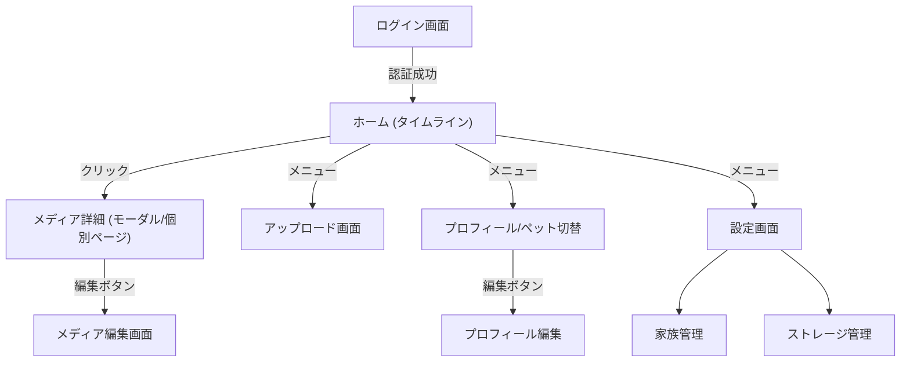
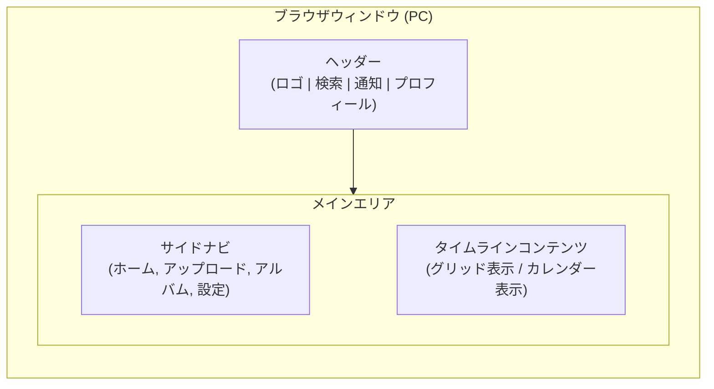
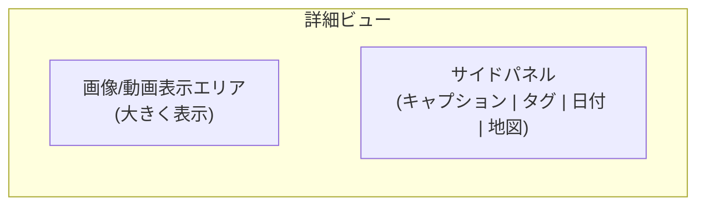
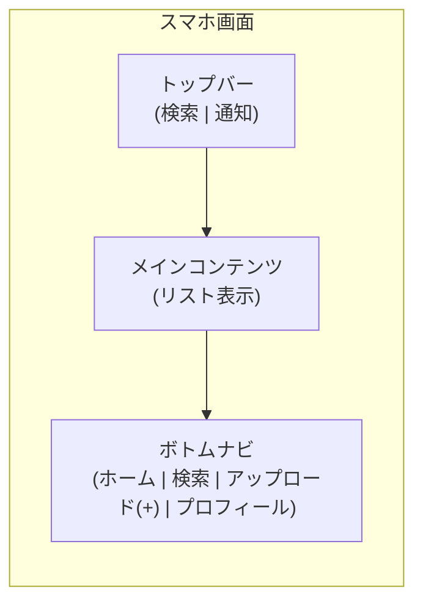
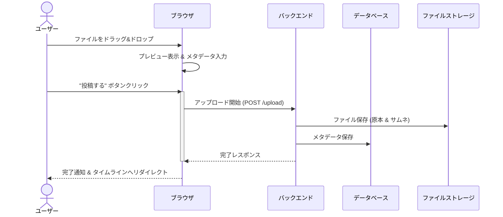
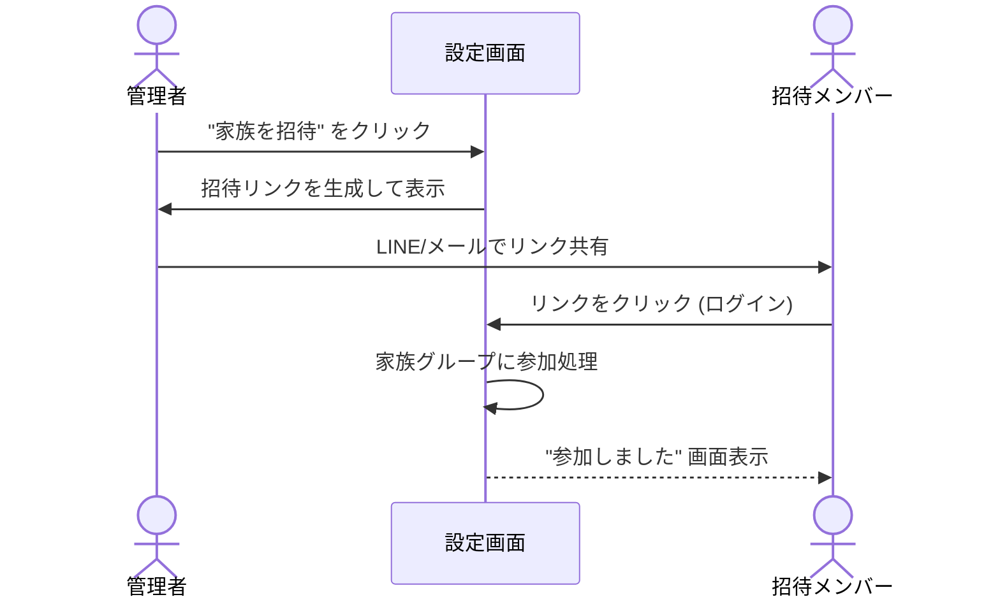

# 画面設計書 (UI/UX Design Document)

## 1. デザインコンセプト (Design Concept)

**テーマ**: "Wag & Warmth" (しっぽ振るような喜びと、家族の温かさ)

- **キーワード**: 親しみやすさ、プレミアム感、没入感
- **トーン＆マナー**:
  - ベース: シンプルでクリーンな白/オフホワイト (#FDFCF8)
  - アクセント: テラコッタオレンジ (#E07A5F)
  - フォント: Noto Sans JP / Inter

## 2. 画面遷移図 (Screen Transition Diagram)

サイト全体の画面構成と遷移フローを可視化します。

## 3. ワイヤーフレーム (Page Layouts)

主要画面のレイアウト構成。

### 3.1 ホーム (Home) - PC View

### 3.2 メディア詳細 (Media Detail) - PC View

### 3.3 スマホ表示 (Mobile View)

## 4. 操作フロー (User Flows)

主要なユーザーアクションの流れ。

### 4.1 アップロードフロー (Upload Flow)

### 4.2 家族招待フロー (Family Invitation Flow)

## 5. デザインシステム (Design System)

### 5.1 カラーパレット

| Role | Color Name | Hex Code | Usage |
| :--- | :--- | :--- | :--- |
| **Primary** | Terracotta | `#E07A5F` | キーアクションボタン, アクティブアイコン |
| **Secondary** | Sage Green | `#81B29A` | 成功メッセージ, タグ背景 |
| **Background** | Off White | `#FDFCF8` | メイン背景 |
| **Surface** | Pure White | `#FFFFFF` | カード, モーダル背景 |
| **Text** | Charcoal | `#3D405B` | 見出し, 本文 |

### 5.2 コンポーネント

- **Media Card**: 角丸12px, ソフトな影, ホバーでズーム。
- **Buttons**:
  - Primary: 塗りつぶし (#E07A5F), 丸みのある形状。
  - Secondary: 枠線のみ。
- **Feedback**:
  - Loading: スケルトンスクリーン。
  - Success/Error: Toast通知。
