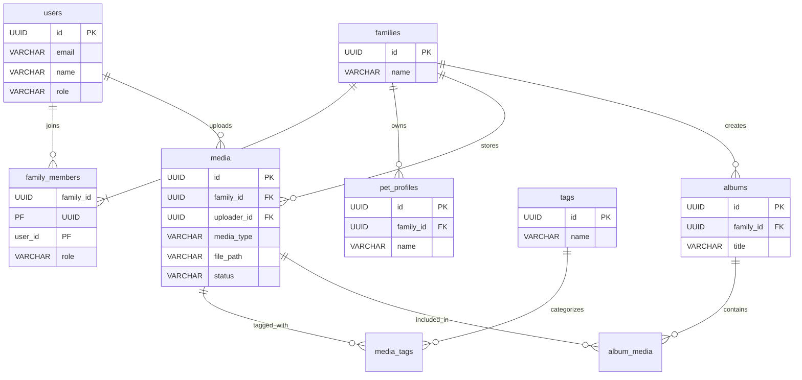

# 詳細データ設計書 (Detailed Data Design Document)

## 1. 物理設計方針 (Physical Design Principles)

- **Database Engine**: PostgreSQL 15+
- **Character Set**: UTF-8
- **Timezone**: UTC (アプリケーション側でJST変換)
- **ID Strategy**: UUID v7 (時系列ソート可能なUUID) を採用し、インデックス性能と分散性を両立。
- **Naming Convention**: スネークケース (`user_id`, `created_at`)

## 2. テーブル定義 (Table Definitions)

### 2.1 users

ユーザー（Googleアカウント）情報を管理する。

| Column | Type | Nullable | Default | Description |
| :--- | :--- | :--- | :--- | :--- |
| `id` | `UUID` | NO | PK | ユーザーID (UUIDv7) |
| `email` | `VARCHAR(255)` | NO | | Google Email (Unique) |
| `name` | `VARCHAR(100)` | NO | | 表示名 |
| `avatar_url` | `TEXT` | YES | | プロフィール画像URL |
| `role` | `VARCHAR(20)` | NO | `'member'` | `admin`, `member` |
| `created_at` | `TIMESTAMPTZ` | NO | `CURRENT_TIMESTAMP` | 作成日時 |
| `updated_at` | `TIMESTAMPTZ` | NO | `CURRENT_TIMESTAMP` | 更新日時 |

- **Indexes**:
  - `users_email_key` (UNIQUE) ON `email`

### 2.2 families

写真共有のグループ単位。

| Column | Type | Nullable | Default | Description |
| :--- | :--- | :--- | :--- | :--- |
| `id` | `UUID` | NO | PK | 家族ID |
| `name` | `VARCHAR(100)` | NO | | 家族名（「佐藤家」など） |
| `created_at` | `TIMESTAMPTZ` | NO | `CURRENT_TIMESTAMP` | |

### 2.3 family_members

ユーザーと家族の所属関係（多対多）。

| Column | Type | Nullable | Default | Description |
| :--- | :--- | :--- | :--- | :--- |
| `family_id` | `UUID` | NO | FK | Ref `families.id` (Cascade) |
| `user_id` | `UUID` | NO | FK | Ref `users.id` (Cascade) |
| `role` | `VARCHAR(20)` | NO | `'member'` | `owner`, `member` |
| `joined_at` | `TIMESTAMPTZ` | NO | `CURRENT_TIMESTAMP` | |

- **PK**: `(family_id, user_id)`

### 2.4 pet_profiles

ペット情報。

| Column | Type | Nullable | Default | Description |
| :--- | :--- | :--- | :--- | :--- |
| `id` | `UUID` | NO | PK | ペットID |
| `family_id` | `UUID` | NO | FK | Ref `families.id` (Cascade) |
| `name` | `VARCHAR(50)` | NO | | ペット名 |
| `species` | `VARCHAR(50)` | NO | | `dog`, `cat`, etc. |
| `breed` | `VARCHAR(100)` | YES | | 犬種・猫種 |
| `gender` | `VARCHAR(10)` | YES | | `male`, `female`, `unknown` |
| `birth_date` | `DATE` | YES | | 誕生日 |
| `adoption_date`| `DATE` | YES | | お迎え日 |
| `avatar_url` | `TEXT` | YES | | |
| `created_at` | `TIMESTAMPTZ` | NO | `CURRENT_TIMESTAMP` | |

- **Indexes**:
  - `idx_pets_family` ON `family_id`

### 2.5 media

写真・動画アセット。

| Column | Type | Nullable | Default | Description |
| :--- | :--- | :--- | :--- | :--- |
| `id` | `UUID` | NO | PK | メディアID |
| `family_id` | `UUID` | NO | FK | Ref `families.id` (Cascade) |
| `uploader_id`| `UUID` | YES | FK | Ref `users.id` (Set Null) |
| `media_type` | `VARCHAR(10)` | NO | | `image`, `video` |
| `original_filename`| `VARCHAR(255)`| NO | | アップロード時のファイル名 |
| `file_path` | `TEXT` | NO | | ストレージ上のパス (Key) |
| `thumbnail_path`| `TEXT` | YES | | サムネイルのパス |
| `file_size` | `BIGINT` | NO | | バイト数 |
| `width` | `INTEGER` | YES | | |
| `height` | `INTEGER` | YES | | |
| `taken_at` | `TIMESTAMPTZ` | YES | | 撮影日時 (Exif) |
| `is_favorite`| `BOOLEAN` | NO | `FALSE` | |
| `status` | `VARCHAR(20)` | NO | `'processing'`| `processing`, `ready`, `error` |
| `created_at` | `TIMESTAMPTZ` | NO | `CURRENT_TIMESTAMP` | |

- **Indexes**:
  - `idx_media_family_taken` ON `(family_id, taken_at DESC)` (タイムライン用)
  - `idx_media_family_fav` ON `(family_id, is_favorite)` WHERE `is_favorite` = TRUE

### 2.6 tags

タグマスタ。

| Column | Type | Nullable | Default | Description |
| :--- | :--- | :--- | :--- | :--- |
| `id` | `UUID` | NO | PK | |
| `name` | `VARCHAR(50)` | NO | | タグ名 |

- **Indexes**:
  - `tags_name_key` (UNIQUE) ON `name`

### 2.7 media_tags

メディアとタグの関連。

| Column | Type | Nullable | Default | Description |
| :--- | :--- | :--- | :--- | :--- |
| `media_id` | `UUID` | NO | FK | Ref `media.id` (Cascade) |
| `tag_id` | `UUID` | NO | FK | Ref `tags.id` (Cascade) |

- **PK**: `(media_id, tag_id)`

### 2.8 albums

アルバム（コレクション）。

| Column | Type | Nullable | Default | Description |
| :--- | :--- | :--- | :--- | :--- |
| `id` | `UUID` | NO | PK | |
| `family_id` | `UUID` | NO | FK | Ref `families.id` |
| `title` | `VARCHAR(100)` | NO | | |
| `description`| `TEXT` | YES | | |
| `created_at` | `TIMESTAMPTZ` | NO | `CURRENT_TIMESTAMP` | |

### 2.9 album_media

アルバム内のメディアと順序。

| Column | Type | Nullable | Default | Description |
| :--- | :--- | :--- | :--- | :--- |
| `album_id` | `UUID` | NO | FK | Ref `albums.id` (Cascade) |
| `media_id` | `UUID` | NO | FK | Ref `media.id` (Cascade) |
| `display_order`| `INTEGER` | NO | 0 | |

- **PK**: `(album_id, media_id)`
- **Indexes**:
  - `idx_album_order` ON `(album_id, display_order)`

## 3. ER図 (ER Diagram)



## 4. ストレージ構造 (Storage Structure)

物理ファイル（写真・動画）は、GCEのPersistent Disk上の特定のディレクトリ構造で管理します。

- **Root Directory**: `/app/uploads` (Docker Volumeとしてマウント)
- **Directory Hierarchy**: `/{family_id}/{yyyy}/{mm}/{filename}`
  - `family_id` で分割することで、テナント（家族）間のデータ分離性を物理レベルでも意識し、将来的なエクスポートや退避を容易にする。
  - 年月 (`yyyy/mm`) で分割することで、1ディレクトリ内のファイル数肥大化（iノード枯渇やパフォーマンス低下）を防ぐ。

### 構成例

```text
/app/uploads/
  ├── {family_uuid}/            # 家族ごとのルート
  │   ├── 2024/
  │   │   ├── 01/
  │   │   │   ├── {media_uuid}.jpg        # オリジナル画像 (保存用)
  │   │   │   ├── {media_uuid}_thumb.webp # サムネイル (表示用)
  │   │   │   └── {video_uuid}.mp4        # 動画実体
  │   │   └── 02/
  │   └── temp/                 # アップロード一時処理用
  └── system/                   # システムアセット等
```

## 5. 補足: UUID v7 について

UUID v7 はタイムスタンプベースのUUIDであり、データベースのB-treeインデックスにおいて挿入性能が良く、時系列順にソート可能です。これにより `created_at` インデックスの代用としても機能します。
Pythonでは `uuid6` ライブラリ等を利用して生成します。
