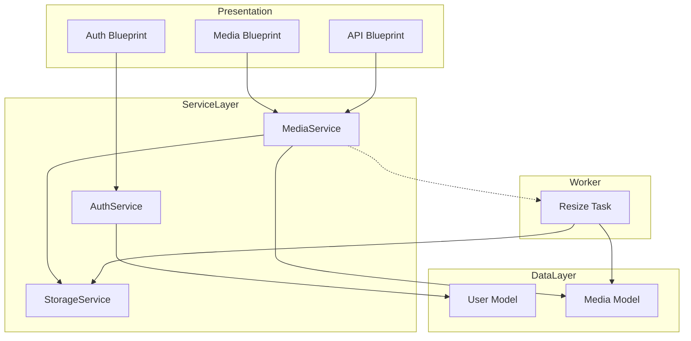

# モジュール・コンポーネント設計書 (Module & Component Design Document)

## 1. 全体構造 (Overall Structure)

本システムは **Flask** をベースとした **Modular Monolith** アーキテクチャを採用します。機能ごとにモジュール（Blueprint）を分割し、ビジネスロジックは **Service Layer** に集約することで、将来的な拡張性とテスト容易性を担保します。

### レイヤー構造

1. **Presentation Layer (Web/API)**:
    * Flask Blueprints, Jinja2 Templates
    * 責務: リクエストの受付、バリデーション、レスポンスの返却。ビジネスロジックは持たない。
2. **Service Layer (Business Logic)**:
    * Python Classes
    * 責務: ユースケースの実装、トランザクション管理、権限チェック。
3. **Data Access Layer (Repository/Model)**:
    * SQLAlchemy Models
    * 責務: データベースへのCRUD操作。
4. **Worker Layer (Async Tasks)**:
    * Celery Tasks
    * 責務: 画像処理、動画変換などの非同期ジョブ実行。

## 2. ディレクトリ構成 (Directory Structure)

```text
/thesalo-gallery
  /app
    /__init__.py          # App Factory (create_app)
    /config.py            # Configuration Classes
    /extensions.py        # Flask Extensions (db, login_manager, celery, etc.)
    /blueprints           # Presentation Layer
        /auth/            # Auth Flow
        /main/            # Public Pages (LP, etc.)
        /dashboard/       # User Dashboard (Timeline)
        /media/           # Media Management
        /family/          # Family Mgmt
        /api/             # REST API Endpoints
    /services             # Service Layer
        auth_service.py
        media_service.py
        family_service.py
        storage_service.py
    /models               # Data Access Layer
        user.py
        media.py
        family.py
    /tasks                # Worker Layer
        media_tasks.py    # Resize, Transcode
        ai_tasks.py       # Face Detection
    /static               # Static Assets
    /templates            # HTML Templates
  /tests                  # Unit/Integration Tests
```

## 3. モジュール詳細 (Module Details)

### 3.1 認証モジュール (Auth Module)

* **Blueprint**: `auth_bp` (`/auth`)
* **Service**: `AuthService`
  * `login_with_google(token)`: Google ID Token検証、ユーザー作成/取得、セッション確立。
  * `logout()`: セッション破棄。
  * `get_current_user()`: セッションからユーザーロード。
* **Dependencies**: `Authlib`, `Flask-Login`

### 3.2 メディアモジュール (Media Module)

* **Blueprint**: `media_bp` (`/media`), `api_bp` (`/api/v1/media`)
* **Service**: `MediaService`
  * `upload_media(file, user_id, family_id)`: ファイル保存、DB登録、非同期タスク起動。
  * `get_timeline(family_id, filters)`: タイムライン用メディア取得。
  * `delete_media(media_id)`: 論理削除または物理削除。
* **Tasks**:
  * `process_image_task(media_id)`: リサイズ、WebP変換。
  * `process_video_task(media_id)`: HLS変換、サムネ生成。

### 3.4 ストレージモジュール (Storage Module)

* **Service**: `StorageService`
  * 抽象化されたファイル操作インターフェース。
  * `save(file_obj, path)`: ローカルファイルシステム (GCE Persistent Diskのマウント先) へ保存。
  * `get_url(path)`: アクセス用URL生成。
  * `delete(path)`: ファイル削除。

### 3.3 家族・ペットモジュール (Family Module)

* **Blueprint**: `family_bp` (`/family`)
* **Service**: `FamilyService`
  * `create_family(name, owner_id)`: 家族作成。
  * `invite_member(family_id, email)`: 招待リンク生成。
  * `add_pet(family_id, pet_data)`: ペット登録。

## 4. 依存関係図 (Dependency Graph)


